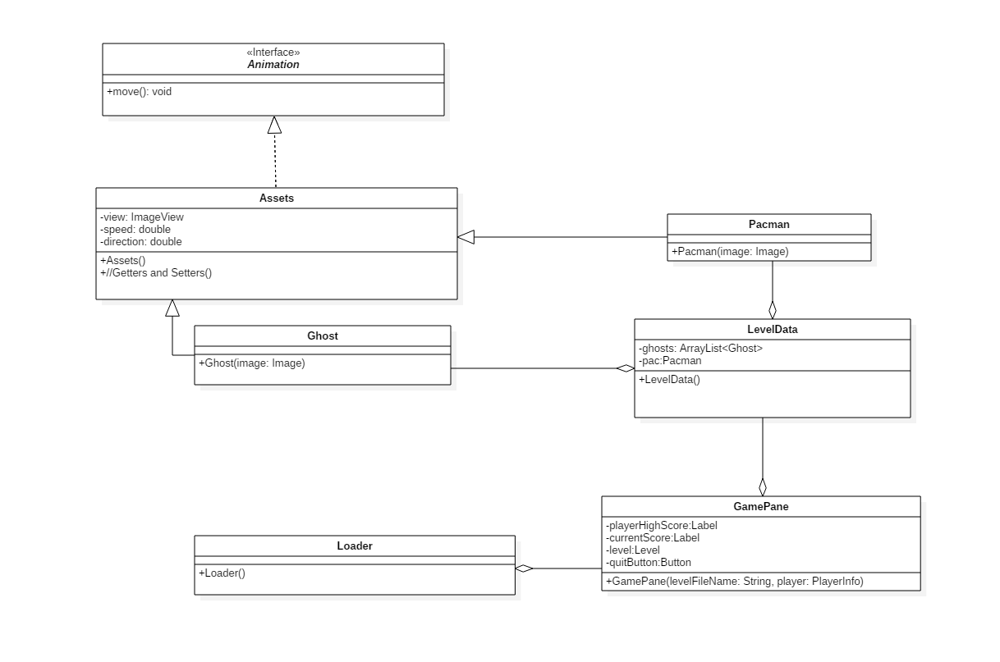
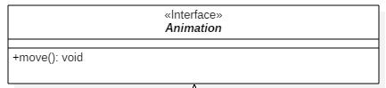
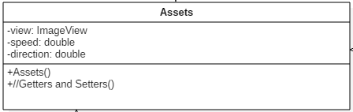
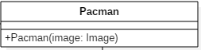
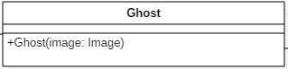
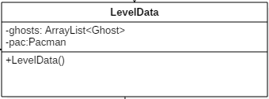
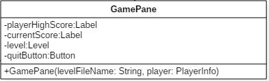
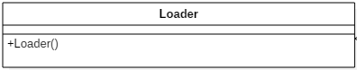
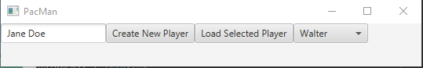
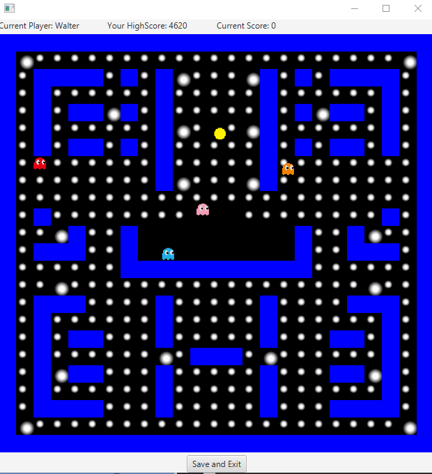

##  Introduction

This assignment requires you to create a Java FX application that is a recreation of the 80's classic, Pacman. Solution is under PacMan folder.

## UML Domain Diagram

## Classes

You are required to implement all of the classes listed in the UML Domain Diagram above. Below are additional details that could provide some help for certain classes.

###  Animation(Interface)

This interface has one method called moved. In the classes that implement this interface this logic below can help you get your characters to move:
`public void move() {
        this.setTranslateX(this.getTranslateX() + getSpeed() * Math.cos(getDirection() * (Math.PI * 2) / 360));
        this.setTranslateY(this.getTranslateY() + getSpeed() * Math.sin(getDirection() * (Math.PI * 2) / 360));
 }`
 
 
### Assets

This class will have the methods and properties that your characters need to function.

### Pacman

Pacman needs to be able to move up, down, left, right. How you implement this is entirely up to you. This class also is where you set PacMan's image

### Ghost

This is where the image is set for the Ghost class. Do not hard code it in to be one ghost. You need to be able to pass in a image object when you create a ghost so that way you can have 4 different ones with all the properties. The ghosts being Blinky, Pinky, Inky and Clyde.

### LevelData

This pane is the class where you will read the levelData to create the field. The field being the walls, pellets, ghosts, etc. It is up to you how you do the walls. Use the ghosts, pellets, and pacman sprites in the spritesheet. The walls can be made using JavaFX Rectangles. You can create your own classes for the pellets and the walls if you would like, but make sure for the pellets you're using the ones from the spritesheet. The scores for the pellets are up to you. The large pellet is upon eating is supposed to make the ghosts turn blue briefly. The levelData.txt has a set of letters and numbers that mean different things. You can section off what part of the spritesheet you want to use by using JavaFX's Rectangle2D class and ImageView class. Your goal is to generate the level with all the assets based off of that text file. I have listed what each thing means below.

`
1 = Wall
0 = Pellet
L = Large Pellet
N = Nothing
I = Inky
P = Pinky
C = Clyde
B = Blinky
G = Pacman
`

### Game Pane

The GamePane is the pane that contains everything. In the center is the pane generated from the LevelData class and on the top and bottom will be the game info. For example the top needs to have a track of the current score, list who has the high score, and who is currently playing. The bottom needs to have a button to save and quit.

### Loader

This class pops up a GUI that allows you to select a player in the list or create a new player from the input in the textfield.There is a list of the players and their scores so make sure that it's updated if a new player gets added and if a current player beats their own highscore. A combobox is useful for having players on a list.

#### Example: 

## Tips:
Use the AnimationTimer to get the animation for your ghosts and various animations. The AnimationTimer is a class that tells the handle method to be called every frame of your application. This is where you should put different things like calling a method for your ghosts that tell them to move or to have a way have your PacMan cycle through different eating phases *opening and closing his mouth*.

## What the Game Should Look Like

### 

